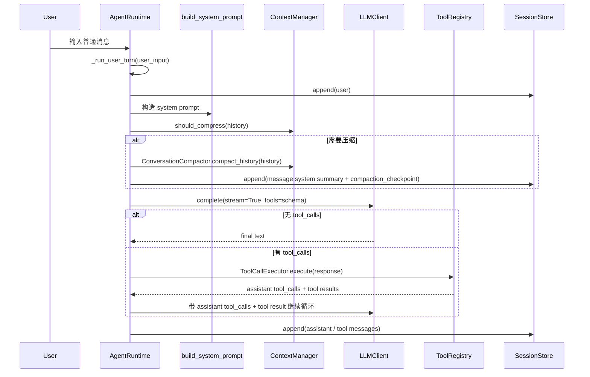
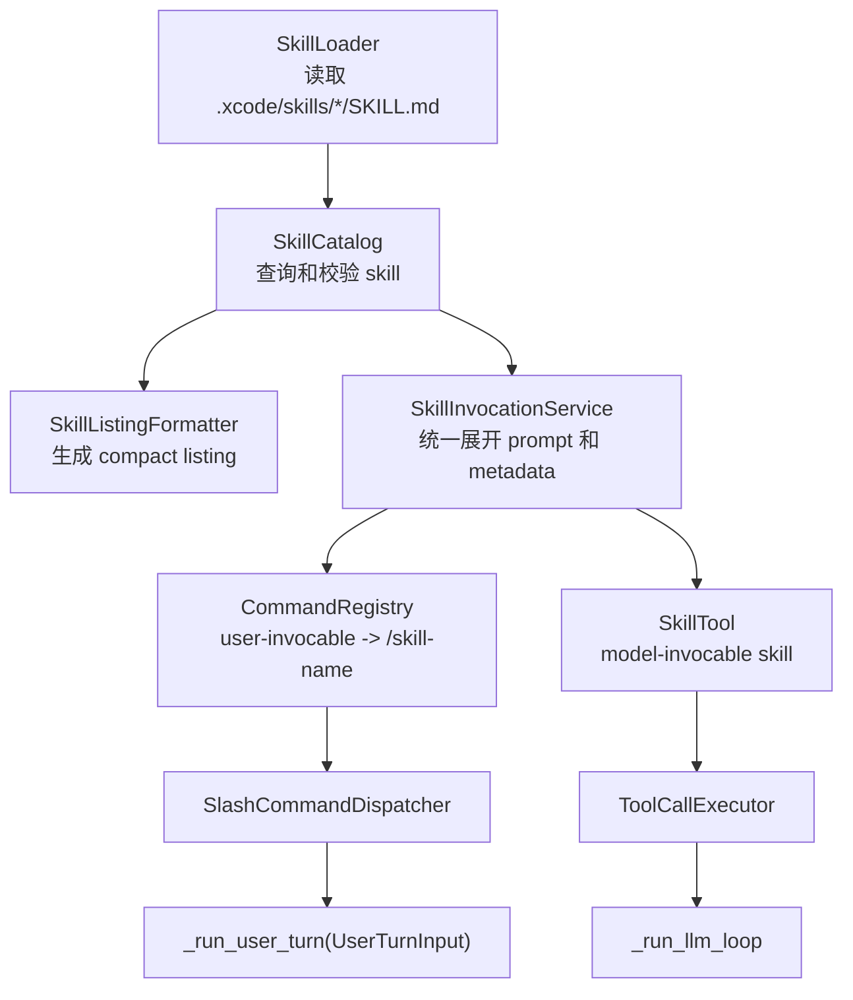
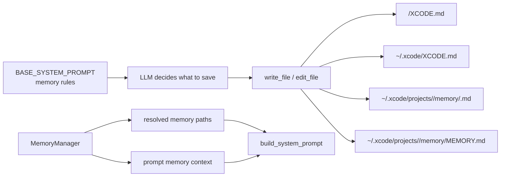
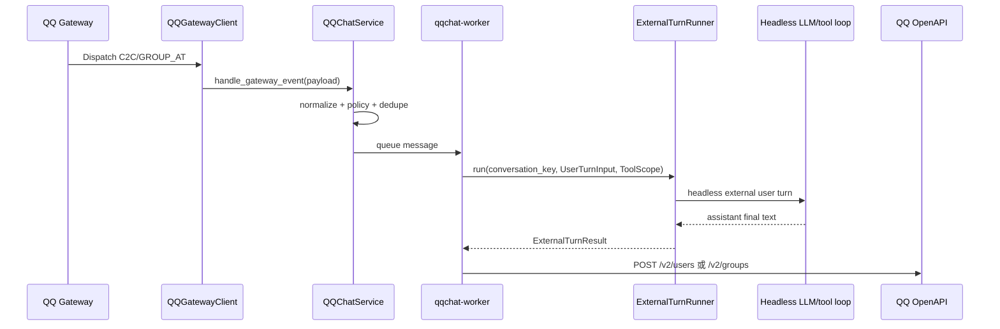

# Xcode 当前架构

> 本文档只描述当前代码已经实现的系统。未来计划和未实现方案放在 `ROADMAP.md`，历史推进过程放在 `PROGRESS.md`，坑和设计取舍放在 `DEVNOTES.md`。

## 1. 系统定位

Xcode 是一个 terminal-native AI coding agent，核心形态是 Python CLI REPL。它通过 OpenAI-compatible API 调用 LLM，并向模型暴露文件、搜索、shell、子 Agent、任务追踪、计划模式和记忆相关工具。

当前版本的主循环是同步实现，不引入 `asyncio`。并发只用于子 Agent，由 `ThreadPoolExecutor` 承担。

## 2. 组件关系图

```mermaid
flowchart TD
    Main["main.py / Typer CLI"] --> Runtime["AgentRuntime<br/>core/agent.py"]
    Main --> Dashboard["Dashboard<br/>core/dashboard.py"]
    Main --> ToolCLI["xcode tool run/grep/glob"]
    Main --> SkillCLI["xcode skill ..."]
    SkillCLI --> SkillCmd["SkillCommandService<br/>core/commands/skill.py"]

    Runtime --> Prompt["PromptSession<br/>prompt_toolkit"]
    Runtime --> Config["ConfigStore<br/>core/config.py"]
    Runtime --> LLM["LLMClient<br/>core/llm.py"]
    Runtime --> Registry["ToolRegistry<br/>core/tool_registry.py"]
    Runtime --> Permissions["PermissionManager<br/>core/permissions.py"]
    Runtime --> Context["ContextManager<br/>core/context.py"]
    Runtime --> Memory["MemoryManager<br/>core/memory.py"]
    Runtime --> Sessions["SessionStore<br/>core/session.py"]
    Runtime --> Resume["SessionResumeBuilder<br/>core/session_resume.py"]
    Runtime --> ResumeSvc["ResumeCommandService<br/>core/conversation/resume.py"]
    Runtime --> Compactor["ConversationCompactor<br/>core/conversation/compaction.py"]
    Runtime --> Approval["ToolApprovalController<br/>core/tooling/approval.py"]
    Runtime --> ToolExec["ToolCallExecutor<br/>core/tooling/execution.py"]
    Runtime --> ShellUI["ShellUI<br/>core/ui/shell.py"]
    Runtime --> Slash["SlashCompleter<br/>core/commands/slash.py"]
    Runtime --> SlashDispatch["SlashCommandDispatcher<br/>core/commands/dispatcher.py"]
    Runtime --> SkillCmd
    Runtime --> Status["RuntimeStatusStore<br/>core/runtime_status.py"]
    Runtime --> Plan["PlanMode<br/>core/planning.py"]
    Runtime --> Tasks["TaskTracker<br/>core/task_tracker.py"]
    Runtime --> SkillLoader["SkillLoader<br/>skills/loader.py"]
    Runtime --> CommandRegistry["CommandRegistry<br/>core/commands/registry.py"]
    Runtime --> Renderer["OutputRenderer<br/>ui/renderer.py"]

    ResumeSvc --> Resume
    Compactor --> Context
    ToolExec --> Registry
    ToolExec --> Permissions
    ToolExec --> Approval
    ToolExec --> Memory
    SlashDispatch --> PromptCmds["PROMPT_COMMANDS<br/>core/commands/slash.py"]
    SlashDispatch --> CommandRegistry
    CommandRegistry --> SkillLoader
    SkillCmd --> SkillLoader

    Registry --> FileTools["read_file / write_file / edit_file"]
    Registry --> SearchTools["grep / glob"]
    Registry --> ShellTool["run_shell"]
    Registry --> Dispatch["dispatch_agent"]
    Registry --> TaskTools["task_create / task_update / task_list"]
    Registry --> PlanTools["enter_plan_mode / write_plan / exit_plan_mode"]
```



## 3. 入口和主循环

`src/xcode_cli/main.py` 使用 Typer 暴露这些入口：

| 入口 | 当前行为 |
|------|----------|
| `xcode` | 没有子命令时直接启动 `AgentRuntime().run_chat()` |
| `xcode chat` | 启动交互式聊天 |
| `xcode dashboard` | 打开 API 配置 TUI |
| `xcode tool run` | 直接运行 read/write/edit/shell/grep/glob |
| `xcode tool grep` / `xcode tool glob` | PowerShell 友好的搜索子命令 |
| `xcode skill list/show/validate` | 查看和校验项目 `.xcode/skills` skill；旧 install/enable/disable 仅输出迁移提示 |

`AgentRuntime.run_chat()` 是 REPL 输入循环。它负责创建 UUID session id、写入 runtime status、读取用户输入、处理退出和 slash command 分发；一旦得到普通 user input，就统一交给 `_run_user_turn()`。

经过两轮模块化重构后，`AgentRuntime` 仍是 orchestration 入口，但不再直接承载所有细节：

- slash completion 已移到 `core/commands/slash.py`。
- slash command 解析和分发已移到 `core/commands/dispatcher.py`。
- CLI / REPL skill 命令共享逻辑已移到 `core/commands/skill.py`。
- 欢迎信息、状态栏、用户/助手基础输出已移到 `core/ui/shell.py`。
- `/resume` 命令编排已移到 `core/conversation/resume.py`。
- `/compact` 和自动 compression checkpoint 编排已移到 `core/conversation/compaction.py`。
- 工具审批菜单已移到 `core/tooling/approval.py`。
- tool call 执行、diff preview、memory auto-allow、工具结果摘要已移到 `core/tooling/execution.py`。
- `/env` 仪表盘已移到 `core/ui/env_dashboard.py`（全屏 TUI，管理 5 项非 API 参数）。
- 普通 user turn 已收口到 `_run_user_turn()`：session 持久化、history 更新、system prompt 构建、LLM 调用、错误短路、assistant 响应追加和 plan approval 展示都走同一条路径。

当前仍留在 `agent.py` 内的主要职责是 REPL orchestration、工具注册、plan/memory/env/context 命令 glue，以及 `_run_llm_loop()` 的 LLM/tool loop orchestration。也就是说，第二轮重构之后，命令路由、skill 命令服务和普通 turn 路径已经收口；`_run_llm_loop()` 仍暂时保留在 `agent.py`，避免在 streaming、Thinking Live、tool loop、task panel 和 transcript 写入等高风险路径上做过大搬迁。

## 4. 普通对话数据流



当前真正参与 LLM 推理的对话状态是运行时内存里的 `self._history`。`SessionStore` 负责 append-only transcript，`SessionResumeBuilder` 负责从 transcript 构造可恢复 history。普通输入、`/init` 展开的 prompt command、project skill prompt command、以及后续可能出现的外部入口都应复用 `_run_user_turn()`，避免出现第二条 user turn 路径。

`_run_llm_loop()` 使用持续循环推进 assistant tool calls 和 tool results，不依赖固定轮数上限。2026-06-10 的原生 PowerShell/cmd.exe E2E 已确认多轮 tool call 可以持续推进，工具摘要和终端渲染状态不会让循环提前结束。

## 5. Slash Command 流程

用户输入以 `/` 开头时会先交给 `SlashCommandDispatcher.dispatch()`。命令补全和 prompt command 注册表由 `core/commands/slash.py` 提供；dispatcher 只负责路由，不直接扫描项目、不调用 LLM、不写文件。

Slash command 分两类：

- prompt command：例如 `/init` 和项目 skill `/skill-name`，handler 返回固定或展开后的 prompt，dispatcher 返回 `kind="prompt"`，`AgentRuntime` 将其作为普通 user input 交给 `_run_user_turn()`。
- side-effect command：例如 `/help`、`/context`、`/skill`、`/resume`、`/compact`，dispatcher 调用本地 handler 后返回 `kind="handled"`，不会进入 LLM。

其中 `/init` 是 built-in prompt command：handler 返回固定初始化 prompt，`AgentRuntime` 将其展开为普通 user message 并复用现有 LLM/tool loop 路径，而不是在 handler 内扫描项目或写文件。项目 skills 也是 prompt command：`CommandRegistry` 从 `.xcode/skills/<name>/SKILL.md` 注册 `/name`，UI transcript 显示原始 `/name args`，模型 history 使用展开后的 hidden/model prompt。

| 命令 | 实现位置 | 当前能力 |
|------|----------|----------|
| `/help` | `SlashCommandDispatcher` + `agent.py` help handler | 展示命令列表 |
| `/init` | `PROMPT_COMMANDS` + `SlashCommandDispatcher` + `_run_user_turn()` | 展开为仓库初始化 prompt，作为普通用户任务运行，Agent 可自行创建或改进 `XCODE.md` |
| `/context` | `_handle_context_command()` | 展示 token 估算、预算、压缩阈值和消息数 |
| `/dashboard` | `Dashboard().run()` | 打开 API 配置界面 |
| `/skill` | `SlashCommandDispatcher` + `SkillCommandService` | list/show/validate 项目 skills，与 CLI `xcode skill ...` 共享业务逻辑 |
| `/env` | `_handle_env_command()` → `EnvDashboard` | 全屏 TUI 仪表盘：管理 max_tokens、max_summary_chars、response_render_mode、syntax_theme、auto_memory |
| `/plan` | `_handle_plan_command()` | enter/show/approve/reject |
| `/memory` | `_handle_memory_command()` | 查看 memory 状态，开关 auto memory |
| `/compact` | `_handle_compact_command()` + `ConversationCompactor` | 手动触发累积摘要压缩，写入 checkpoint |
| `/resume` | `_handle_resume_command()` + `ResumeCommandService` | 列出当前项目 session，并恢复选中的 transcript |
| `/exit` | `run_chat()` | 退出 |

## 6. Skills 架构

当前 skills 已完成两个阶段：

- Phase 1：项目内 `.xcode/skills/<skill-name>/SKILL.md` 可作为用户手动调用的 prompt slash command，例如 `/review src/foo.py`。
- Phase 2：模型可以根据轻量 skill listing 主动调用 `skill` 工具，在合适任务中按需加载完整 skill prompt。

这两个阶段共享同一套 loader、catalog、prompt expansion 和 invocation metadata，不存在旧 `skill.json` / `enabled_skills` / system prompt 全量注入的第二套语义。

### 6.0 分层总览

Skill 机制分为五层，自底向上：

```text
Layer 0  数据模型        skills/model.py
Layer 1  加载与校验      skills/loader.py, skills/catalog.py, skills/validation.py
Layer 2  调用服务        skills/invocation.py, skills/prompt.py, skills/listing.py
Layer 3  工具注册        core/tools/skill_tool.py, core/tool_registry.py
Layer 4  执行与编排      core/tooling/execution.py, core/agent.py, core/commands/registry.py
```

**Layer 0 — 数据模型**（`skills/model.py`）

`Skill` frozen dataclass，定义 skill 的不可变结构：`name`、`description`、`body`、`allowed_tools`、`when_to_use`、`disable_model_invocation`、`user_invocable`、`context`、`hooks`、`source_hash` 等。`SkillLoadResult` 持有批量加载结果和 notices。

**Layer 1 — 加载与校验**

- `SkillLoader`：从 `.xcode/skills/*/SKILL.md` 扫描加载，自制 YAML frontmatter 解析器，计算 `sha256:` source hash。
- `SkillCatalog`：按名称归一化查找（忽略大小写和前导 `/`），按条件过滤 `user_invocable_skills()` 和 `model_invocable_skills()`，校验模型调用合法性。
- `validate_skills()`：校验名称冲突、`allowed_tools` 工具名、`context=fork` 警告、`hooks` 警告。

**Layer 2 — 调用服务**

- `SkillInvocationService`：唯一的 skill 调用入口。`invoke_for_user()` 跳过模型校验，`invoke_for_model()` 完整校验。内部通过 `SkillPromptExpander.expand()` 展开 `$ARGUMENTS` 和 `${XCODE_SKILL_DIR}`，构造 `SkillInvocation`（含 display/model/audit 三份 metadata）。
- `SkillListingFormatter`：生成 compact listing 注入 system prompt，三级降级预算控制（full → truncated → name_only → name_only_with_omissions）。

**Layer 3 — 工具注册**

`create_skill_tool()` 创建名为 `"skill"` 的 `ToolDef` 注册到 `ToolRegistry`，仅当存在 model_invocable skills 时注册。execute 逻辑调用 `invoke_for_model()`，返回 `<xcode_loaded_skill>` XML 标签包裹的展开内容，并声明 `blocked_tools=["skill"]` 触发防递归。

**Layer 4 — 执行与编排**

- `ToolCallExecutor`：skill barrier 机制（同 turn 阻断后续 tool calls）+ 防递归 blocked-tools 收集。
- `CommandRegistry.from_skills()`：为 user-invocable skills 注册 slash commands。
- `AgentRuntime`：初始化链（loader → catalog → invocation service → command registry → 条件注册 skill tool）、system prompt 注入 listing、`_run_llm_loop` 中累积 blocked_tools 和写入 session transcript。

### 6.1 Skill 目录包

当前只从项目目录加载 skills：

```text
<project>/.xcode/skills/<skill-name>/SKILL.md
```

一个 skill 是目录包，而不是单个裸 markdown 文件：

```text
.xcode/skills/review/
  SKILL.md
  references/
  scripts/
  templates/
  assets/
```

`SKILL.md` 是唯一自动读取入口。`references/`、`scripts/`、`templates/`、`assets/` 等 supporting files 只作为可被 skill prompt 引用的资源保留在目录内，不会在加载阶段自动塞进上下文。当前不会自动读取 `.claude/skills`、用户目录、managed skills、bundled skills、plugin skills 或 MCP skills。

`SkillLoader` 解析 Claude-style frontmatter 和正文，并保存：

| 字段 | 当前行为 |
|------|----------|
| `description` | slash help、completion、`/skill list` 和模型 listing 的核心摘要；缺失时 fallback 到正文第一行 |
| `allowed-tools` | 解析保存并归一化到 audit/model metadata；不作为 tool schema 或 execution 白名单 |
| `argument-hint` / `arguments` | 保存；`argument-hint` 用于命令补全展示，`arguments` 暂不做具名替换 |
| `when_to_use` | 保存；Phase 2 compact listing 会暴露给模型 |
| `disable-model-invocation` | 控制模型是否能通过 SkillTool 调用 |
| `user-invocable` | 控制是否注册为用户 slash command |
| `context: fork` | 保存；当前不支持 fork，调用时返回 unsupported |
| `model` / `effort` / `agent` / `paths` / `hooks` | 解析保存；当前不切模型、不调 effort、不按 path 自动激活、不启动专用 agent、不执行 hooks |

`source_path` 和 `skill_source_hash` 来自真实 `SKILL.md` 文件。它们会进入 invocation metadata，方便 session/resume/compact 和审计判断“本次调用使用的是哪个版本的 skill”。

### 6.2 核心对象分工



- `SkillLoader`：只负责磁盘扫描、frontmatter 解析、source hash 计算和 load notice 收集。
- `SkillCatalog`：负责 `find()`、`user_invocable_skills()`、`model_invocable_skills()` 和模型调用校验；它会排除 built-in command 冲突、`disable-model-invocation: true` 和 `context: fork`。
- `SkillListingFormatter`：把 model-invocable skills 格式化成轻量 listing，并控制长度预算。
- `SkillInvocationService`：唯一的 skill 调用服务。用户 slash command 和模型 SkillTool 都通过它展开 `$ARGUMENTS`、`${XCODE_SKILL_DIR}`，并生成 display/model/audit metadata。
- `CommandRegistry`：把 built-in prompt commands 和 user-invocable skills 合并成 slash command registry；built-in command 冲突时 built-in 优先。
- `SkillTool`：模型入口。它不依赖 slash command registry，也不会把工具调用拼成 `/skill-name args` 再交给 dispatcher。
- `ToolCallExecutor`：执行 SkillTool 后负责 barrier、防递归 blocked-tools、session audit event 收集。

### 6.3 Phase 1：用户手动调用

用户输入 `/review src/foo.py` 的路径：

```text
PromptSession
  -> SlashCommandDispatcher.dispatch("/review src/foo.py")
  -> CommandRegistry 找到 skill prompt command
  -> SkillInvocationService.invoke_for_user("review", "src/foo.py")
  -> UserTurnInput(
       display_content="/review src/foo.py",
       model_content="展开后的 skill prompt",
       metadata={kind, source, skill, args, source_path, skill_source_hash, allowed_tools, model_content}
     )
  -> AgentRuntime._run_user_turn()
```

UI 和轻量 user history 只显示 `/review src/foo.py`，不会把完整 `SKILL.md` 正文刷到用户 transcript。LLM `_history` 使用展开后的 `model_content`。session transcript 的 user event 会保存 `metadata.model_content`，因此 `/resume` 构建 `_history` 时可以恢复隐藏的 skill prompt，而不是只恢复 UI 展示文本。

`context: fork` 的 skill 当前不能 inline 执行。用户手动调用时会得到友好 unsupported 提示，不会打断 REPL 主循环。

### 6.4 Phase 2：模型主动调用

模型主动调用 skills 的路径：

```text
SkillCatalog.model_invocable_skills()
  -> SkillListingFormatter.format()
  -> build_system_prompt(... skill_listing=...)
  -> LLM 看到 Available Skills
  -> LLM 调用 tool: skill(skill="review", args="src/foo.py")
  -> SkillInvocationService.invoke_for_model()
  -> ToolOutput(
       content="<xcode_loaded_skill ...>完整展开 prompt</xcode_loaded_skill>",
       audit_metadata={kind, source, skill, args, source_path, skill_source_hash, allowed_tools},
       blocked_tools=["skill"]
     )
  -> ToolCallExecutor 写入 tool message + skill_invocation audit event
  -> 下一轮 LLM request 继续执行已加载 skill
```

system prompt 只在存在 model-invocable skills 时注入 skill guidance。Plan mode 使用自己的 planning prompt，但也会追加同一份 compact skill listing 和调用规则，避免模型看到 `skill` schema 却没有 available skills 列表。

SkillTool 校验规则：

- `skill` 名不能为空，允许带开头 `/`。
- skill 必须存在于 `SkillCatalog`。
- 不能调用 built-in slash command。
- `disable-model-invocation: true` 会拒绝。
- `context: fork` 会拒绝。
- 不要求 `user-invocable: true`；也就是说，一个 skill 可以不给用户 slash command，但仍允许模型主动调用。

### 6.5 Compact Listing 预算

模型常驻上下文只看到轻量 listing，不包含完整 `SKILL.md` body，也不包含 `allowed-tools`、`hooks`、`paths`、`argument-hint`、`source_path` 或 hash。

预算规则：

```python
SKILL_BUDGET_CONTEXT_PERCENT = 0.01
CHARS_PER_TOKEN = 4
DEFAULT_CHAR_BUDGET = 8_000
MAX_LISTING_DESC_CHARS = 250
```

如果 `config.max_tokens` 可用，listing 字符预算约为 `max_tokens * 1% * 4`；否则 fallback 到 8000 chars。格式化策略是：

1. 按 skill id 稳定排序。
2. 优先输出 `name + description + when_to_use`。
3. 超预算时把每条 summary 截断到 250 chars。
4. 仍超预算时退化为只显示 skill name。
5. name-only 仍超预算时只保留预算内条目，并尽量追加 omitted count。

### 6.6 allowed-tools 语义

`allowed-tools` 与 Claude Code 语义对齐：它是 skill 声明的工具需求、允许或未来可预授权集合，不是当前 turn 的 exhaustive whitelist。

当前 Xcode 的实际行为：

- loader 解析 `allowed-tools`，支持 Claude-style 名称、逗号分隔、inline list 和 YAML 多行 list。
- invocation service 将工具名归一化后写入 `audit_metadata["allowed_tools"]` 和 `model_metadata["allowed_tools"]`。
- `allowed-tools` 不收窄 `ToolRegistry.get_openai_schemas()`。
- `allowed-tools` 不参与 `ToolCallExecutor` 的执行拒绝逻辑。
- `allowed-tools` 不自动提权；`write_file`、`edit_file`、`run_shell` 仍必须经过 `PermissionManager` 和审批流程。

如果后续需要“严格限制某个 skill 能看到哪些工具”，应设计独立字段，例如 `tool-scope`、`visible-tools` 或 `restricted-tools`。如果后续需要“信任某个 skill 后免审”，应设计独立 trust policy。不要把这两类语义混进 Claude-compatible `allowed-tools`。

### 6.7 防递归、barrier 和 session

SkillTool 成功加载 skill 后有两层防递归：

1. `ToolOutput.blocked_tools=["skill"]` 进入 `AgentRuntime._current_blocked_tools`，下一次 LLM request 的 tool schemas 不再包含 `skill`。
2. `ToolCallExecutor.execute(... blocked_tools=...)` 在执行层也会拒绝 blocked tool，即使模型仍返回隐藏掉的 `skill` tool call，也不会执行。

SkillTool 还是当前 tool batch 的 barrier。同一个 assistant response 中，如果 `skill(...)` 后面还有 sibling tool calls，后续 sibling tools 会被拒绝，要求模型在 loaded skill prompt 真正进入 history 后的下一步再调用工具。

session / resume / compact 的保存策略：

- 用户手动 `/skill-name args`：session user event 保存 display content 和 `metadata.model_content`，resume 时用 hidden model prompt 恢复 `_history`。
- 模型主动 `skill(...)`：tool message 保存 `<xcode_loaded_skill ...>` marker 和完整展开 prompt；额外 `skill_invocation` event 只保存 audit metadata，不保存完整 `model_content`。
- compact 直接压缩当前 `_history`，其中已经包含 loaded skill tool message，因此不需要为 skill 单独重放。

当前未实现能力：

- `context: fork` 子 agent。
- hooks 执行。
- remote / managed / bundled / plugin / MCP skills。
- skill search、ranking 或 paths 条件自动激活。
- 基于 skill `model` / `effort` 的模型切换。

## 7. Tool 系统

工具定义由 `ToolDef` 表达，字段包括：

| 字段 | 用途 |
|------|------|
| `name` | OpenAI function name |
| `description` | 暴露给 LLM 的说明 |
| `parameters` / `required` | JSON schema |
| `execute` | 本地执行函数 |
| `is_read_only` | 权限系统用于区分只读和危险操作 |

`ToolRegistry.get_openai_schemas()` 把工具转换成 OpenAI-compatible tool schema，并支持按 blocked-tools 过滤。`ToolRegistry.execute()` 捕获所有工具异常并返回 `"Tool error: ..."`，避免单个工具异常打崩 Agent 主循环。`ToolCallExecutor` 也会在执行层检查 blocked-tools，防止模型调用当前 turn 禁用的工具。

当前 13 个内置工具：

| 类别 | 工具 |
|------|------|
| 文件 | `read_file`, `write_file`, `edit_file` |
| 搜索 | `grep`, `glob` |
| Shell | `run_shell` |
| 子 Agent | `dispatch_agent` |
| 任务 | `task_create`, `task_update`, `task_list` |
| 计划模式 | `enter_plan_mode`, `write_plan`, `exit_plan_mode` |

工具调用显示当前分两层：

- `core/tooling/display.py` 负责“折叠还是展开”，默认输出一行摘要，例如 `tools: 3 calls: read_file, grep, glob`；危险工具会追加 `[danger]` 标记。
- `core/tooling/execution.py` 负责真正的执行期展示，包括 diff preview、command preview、审批菜单和工具结果摘要；这些内容不受折叠影响。

## 8. 权限和审批模型

权限优先级：

```text
session rule > project .xcode/settings.json > global ~/.xcode/settings.json > default
```

默认策略：

| 工具 | 默认权限 |
|------|----------|
| `read_file`, `grep`, `glob` | `allow` |
| `write_file`, `edit_file`, `run_shell` | `ask` |
| 其他工具 | `ask` |

当权限为 `ask` 时，`ToolCallExecutor` 会在执行前展示工具调用信息。对 `write_file` / `edit_file`，还会先读取旧内容并渲染 diff preview，再通过 `ToolApprovalController` 出现审批 UI。

TTY 环境下审批 UI 是内联三选项菜单：

```text
Yes
No
Yes, for this conversation
```

支持方向键上下选择 + Enter，也保留 `y/n/a` 快捷键。非 TTY fallback 才退回单行 `input()`。

Memory 自管理权限也在 tool execution 层处理：`write_file` / `edit_file` 命中 `MemoryManager.is_memory_write_target()` 的 resolved memory 路径时跳过用户审批，但显式 `deny` 仍优先生效，普通项目文件仍走原有审批流程。

## 8.1 输出渲染模型

`LLMClient.complete(..., stream=True)` 通过 `on_text_token` / `on_reasoning_token` 回调把流式内容交给运行时。当前渲染链路是：

1. `AgentRuntime._run_llm_loop()` 负责 Thinking Live、assistant prefix、LLM/tool loop orchestration。
2. `StreamingTurnRenderer` 负责累积 `content_buffer` / `reasoning_buffer`，并根据 `response_render_mode` 决定是继续 raw streaming，还是停止 streaming 等待最终渲染。
3. `ShellUI.print_assistant_bubble()` / `OutputRenderer` 负责最终的 Rich Markdown 展示。

当前支持两种模式：

- `streaming_plus_final_render`
  - 普通文本继续逐 token 打印。
  - 一旦检测到代码块、标题、表格等结构化 Markdown，就停止继续 raw streaming，只保留 buffer，并在 `finish()` 阶段最终渲染一次。
- `buffer_then_render`
  - 不逐 token 打印文本。
  - 在 `finish()` 后由 `agent.py` 补最终 assistant bubble，确保终端能看到完整回答。

当前实现已经避免“结构化内容先整段 raw、再整段 Rich”的双重输出，但还没有实现可替换区域式 streaming，也没有引入 `Ctrl+O` 之类的交互增强。

## 9. Memory 模型

当前 memory 是文件驱动模型，不提供专用 `memory_save/list/get/delete` 工具。



`MemoryManager` 只负责路径管理、读取 Project/User XCODE.md、读取 auto memory index，以及向 prompt 注入 memory context。是否记、记什么、写到哪里，由 `BASE_SYSTEM_PROMPT` 规则驱动 LLM 使用文件工具完成。

注入顺序在 `build_system_prompt()` 中固定：

1. `BASE_SYSTEM_PROMPT`
2. 当前 working directory
3. 当前项目 resolved memory paths
4. Project XCODE.md、User XCODE.md、Auto Memory Index

Auto memory 当前只自动注入 `MEMORY.md` 索引，详细内容需要 Agent 再用 `read_file` 读取具体 memory 文件。

## 10. Context 和压缩模型

`ContextManager` 持有实例级 `max_tokens` 和 `max_summary_chars`，均从 `Config` 传入（`agent.py:54`）。`max_summary_chars` 设为 `0` 或 `None` 时关闭代码层摘要硬截断，同时 prompt 中不出现字符上限提示。压缩 prompt 中不再使用独立词数限制，统一为 `max_summary_chars` 字符上限。

当前能力：

| 能力 | 实现 |
|------|------|
| token 估算 | 按 ASCII / 非 ASCII 字符粗略估算，并计入 reasoning、tool_calls、tool_call_id |
| 压缩触发 | `estimate_tokens(history) >= max_tokens * 0.8` |
| 压缩结果 | `CompressionResult(messages, summary, checkpoint_message)` |
| 压缩方式 | 保留第一条 user message、写入 system checkpoint summary、保留最近 8 条 |
| 累积摘要 | 有 previous summary 时，生成“旧 summary + 新内容”的累积 summary |
| 摘要语言 | 英文压缩提示词，摘要内容可保留用户原语言 |
| `/context` | 展示当前估算、预算、阈值、消息数量 |

当前 `/context` 还没有 cost 估算。

## 11. Session 和恢复模型

`SessionStore` 会把当前项目的完整 transcript 追加到：

```text
~/.xcode/projects/<project-key>/sessions/<session-uuid>.jsonl
```

`project-key` 由项目绝对路径稳定生成，例如 `D:\Xcode -> D--Xcode`。session id 使用 UUID。

transcript 是 JSONL，每行是一个 event。当前主要 event：

```json
{"type":"message","role":"user","content":"...","ts":"..."}
{"type":"message","role":"assistant","content":"...","tool_calls":[...],"ts":"..."}
{"type":"message","role":"tool","tool_call_id":"call_123","content":"...","ts":"..."}
{"type":"message","role":"system","content":"Conversation summary checkpoint:\n...","ts":"..."}
{"type":"compaction_checkpoint","summary":"...","summary_format":"xcode.v1","source_message_count":120,"ts":"..."}
```

轻量用户输入历史写入：

```text
~/.xcode/history.jsonl
```

runtime status 写入：

```text
~/.xcode/sessions/<pid>.json
```

该文件只表示当前活跃进程，退出时删除。`RuntimeStatusStore.create()` 写入当前进程状态前会调用 `prune_stale()` 扫描 `~/.xcode/sessions/*.json`：dead pid 文件会删除，alive/current pid 文件保留，pid liveness 无法可靠判断时使用 24 小时 TTL 兜底；损坏 JSON 和删除失败不影响主 REPL 启动。

### `/compact`

`/compact` 手动触发 `ContextManager.compress()`。压缩期间通过 `ConversationCompactor.compact_history()` 显示 Rich `Live` 进度（"Compacting context... (Xs)"，复用 Thinking Live 的 `transient` + daemon thread 模式）。成功压缩后：

- 替换运行时 `_history` 为 compressed messages。
- 写入一条 `message(system)`，内容为 checkpoint summary。
- 写入一条 `compaction_checkpoint` event，包含 summary 和压缩元数据。

如果当前消息太少或没有可压缩中间内容，则显示 `Nothing to compact.`，不写 checkpoint。

### `/resume`

`/resume` 是当前恢复入口。TTY 环境下通过方向键 ↑/↓ 浏览 + Enter 确认 + Esc 取消选择 session（复用 `approval.py` 的 `read_key()` 和 ANSI 光标刷新模式）。TTY 菜单采用固定 9 行窗口，只渲染当前选中项附近的 session，header 显示 `current/total`；列表项显示时间、单行化后的最近输入预览和 checkpoint 标记，刷新时固定清理 `header + visible rows + footer` 行。非 TTY 环境回退到数字输入。选中 session 后，`SessionResumeBuilder` 读取 transcript 并构造 budgeted history。

恢复规则：

- 有 `compaction_checkpoint` 时，恢复最新 checkpoint summary + checkpoint 之后的 message events。
- 无 checkpoint 时，只恢复 token budget 内的 recent tail。
- 裁剪时保护 assistant `tool_calls` 和 tool result pair，避免恢复出非法 OpenAI-compatible message 顺序。
- skill invocation 的 transcript user event 保留 `/skill-name args` 展示文本，`metadata.model_content` 保留展开后的 hidden/model prompt；恢复 `_history` 时优先使用 `metadata.model_content`。
- 恢复成功后，`ResumeCommandService` 会额外渲染 `Recent conversation since checkpoint:`，展示最新 checkpoint 后的 user/assistant 对话；无 checkpoint 时展示 transcript 内 user/assistant 对话。
- 最近对话 replay 只用于终端 UI，不参与 LLM `_history`，也不写回 transcript。它使用 transcript display content，因此不会把 skill invocation 的 `metadata.model_content` hidden prompt 显示给用户；assistant tool_call-only 中间消息、tool result、system summary 和 audit event 都会跳过。
- replay 渲染使用 `markup=False` / `highlight=False`，避免用户输入中的 Rich markup 被解析。
- 当前不实现 CLI `--resume` / `--continue`，也不实现 rollback/fork。

2026-06-10 的原生 PowerShell/cmd.exe E2E 已覆盖 `/resume` 固定 9 行长列表、窄窗口和中文预览连续操作、checkpoint 后 replay、tool result/hidden prompt 不显示，以及 `/compact` Rich Live 进度。上述行为已从“自动化覆盖”提升为真实 Windows 终端已验收契约。

## 12. QQ 外部聊天入口

`/QQchat` 是 side-effect slash command，用于启动、停止和查看 QQ bot WebSocket bridge 状态；它不是 prompt command，不会进入普通 `_run_user_turn()`。

当前第一版数据流：

```text
QQChatService
  -> QQGatewayClient
  -> QQEventNormalizer
  -> QQChatConfig policy
  -> QQMessageDedupe
  -> qqchat-worker queue
  -> ExternalTurnRunner
  -> headless LLM/tool loop
  -> QQMessageClient
```

关键边界：

- QQ turn 不复用当前 REPL `_history`。`ExternalTurnRunner` 按 conversation key 维护独立 session id 和独立 history。
- 默认 conversation key：单聊为 `qq:c2c:{user_openid}`，群聊为 `qq:group:{group_openid}:member:{member_openid}`。
- 默认入口级 `ToolScope.visible_tools` 和 `ToolScope.execution_allowlist` 都是 `read_file`、`grep`、`glob`、`task_list`。
- schema 层会按 `ToolScope.visible_tools ∩ execution_allowlist` 过滤模型可见工具；execution 层会再次拒绝不在 allowlist 内的工具调用，并对 `source == "qqchat"` 强制 `ToolDef.is_read_only`。
- QQchat 不复用 skill frontmatter 的 `allowed-tools`。skill `allowed-tools` 只作为 skill metadata 保留，不是外部入口安全字段。
- `QQGatewayClient` 的 WebSocket 依赖在 `start()` 内延迟导入；普通 CLI 启动不依赖真实 QQ 网络。
- WebSocket 回调只把 dispatch payload 交给 `QQChatService.handle_gateway_event()` 入队；`qqchat-worker` 串行执行 runner 和 reply，避免 gateway 线程被 LLM/tool loop 阻塞。
- QQ external turn 走 `_run_external_llm_loop()`，该路径调用普通 `_run_llm_loop()` 的 headless 模式：不创建 streaming renderer、不启动 Rich Live、不打印工具摘要、不更新本地 bottom toolbar 工具计数。
- `QQChatConfig` 在 normalize 后、dedupe 前执行：`enabled`、`enable_c2c`、`enable_group_at`、`group_allowlist`、`owner_openids`、`group_turn_timeout_seconds`、`c2c_turn_timeout_seconds` 都会影响消息是否进入 runner。
- `max_reply_chars` 在发送前截断被动回复，避免长回复直接打到 QQ HTTP 接口限制。
- Gateway status 通过 `on_status -> QQChatService.handle_gateway_status()` 进入 service，`/QQchat status` 可看到最近断线、重连、heartbeat 或 gateway 错误。
- AppSecret、AccessToken 和完整 Authorization header 不写入项目配置、session transcript metadata 或错误输出。

### 12.1 QQchat 运行时数据流



`QQChatService.handle_gateway_event()` 不直接调用 LLM。它只完成轻量同步工作：事件归一化、配置策略过滤、`msg_id` 去重和入队。真正的 runner 调用在 `qqchat-worker` 线程中串行完成。这样即使 QQ 侧瞬时重复投递或 LLM 响应较慢，也不会让 WebSocket 回调线程长时间卡住。

### 12.2 配置策略

`QQChatConfig` 分三类：

| 字段 | 作用 |
|------|------|
| `app_id`, `client_secret` | QQ AccessToken 鉴权；`client_secret` 只允许环境变量或用户级私密配置提供，项目配置不能覆盖 |
| `enabled`, `enable_c2c`, `enable_group_at` | 控制 `/QQchat` 是否可启动，以及是否处理单聊/群聊事件 |
| `group_allowlist`, `owner_openids` | 限制群 openid 和发送者 openid；非空时必须命中才进入 runner |
| `tool_scope` | 入口级工具可见性与执行 allowlist；会被 `sanitize_tool_scope()` 再收窄 |
| `max_reply_chars` | 发送 QQ 被动回复前的最大字符数 |
| `group_turn_timeout_seconds`, `c2c_turn_timeout_seconds` | 根据 QQ 事件 timestamp 丢弃过期消息，避免超过被动回复窗口后继续跑 turn |

策略顺序是：normalize 成 `QQIncomingMessage` 后先检查配置，再调用 dedupe。被配置拒绝的消息不会消耗 `msg_id` 去重记录，也不会进入 worker 队列。

### 12.3 工具安全四层检查

QQ 外部入口的工具执行经过四层独立检查，任一层拒绝即可阻止执行：

```text
Layer 1: sanitize_tool_scope (external_turn.py)
  构造阶段过滤 FORBIDDEN_EXTERNAL_TOOLS 黑名单
      ↓ 通过
Layer 2: schema visible_tools (tool_registry.py)
  schema 暴露阶段只给模型看到 visible_tools
      ↓ 通过
Layer 3: execution_allowlist + is_read_only (execution.py)
  执行阶段检查工具是否在白名单内
  QQ 来源还必须是 ToolDef.is_read_only
      ↓ 通过
Layer 4: permissions + remote_approval (execution.py + permissions.py)
  权限阶段检查 ask 级工具是否需要本地审批
```

**Layer 1 — `sanitize_tool_scope`（构造阶段）**

`FORBIDDEN_EXTERNAL_TOOLS` 硬编码黑名单，从 `execution_allowlist` 和 `visible_tools` 中移除：

| 黑名单工具 | 原因 |
|-----------|------|
| `write_file` | 写文件 |
| `edit_file` | 编辑文件 |
| `run_shell` | 执行 shell 命令 |
| `dispatch_agent` | 派发子 Agent |
| `skill` | 加载 skill（可间接执行任意工具） |

此层在 `ExternalTurnRunner.run()` 和 `QQChatService._coerce_tool_scope()` 中调用，确保配置文件即使写了危险工具也会被移除。

**Layer 2 — schema 可见性**

`ToolRegistry.get_openai_schemas()` 接收 `visible_tools`，只把 `ToolScope.visible_tools` 中的工具 schema 暴露给模型。被隐藏的工具通常不会被模型调用。

**Layer 3 — `execution_allowlist` 与只读检查（执行阶段）**

`ToolCallExecutor.execute()` 会检查工具是否在 `tool_scope.execution_allowlist` 中。不在白名单内的工具直接返回 `"blocked by entry tool scope"` 错误，不执行。对 `source == "qqchat"`，即使工具被用户加入 allowlist，也必须满足 `ToolRegistry.is_read_only(tool_name)`；因此 `task_create`、`task_update`、`write_plan` 这类非只读本地状态修改工具会在 execution 层被拒绝。

**Layer 4 — `permissions` + `remote_approval`（执行阶段）**

`ToolCallExecutor.execute()` 最后调用 `PermissionManager.check()`：

1. 调用 `PermissionManager.check()` 获取权限等级（`allow` / `deny` / `ask`）。
2. `deny` → 拒绝。
3. `ask` + `remote_approval=False` → 拒绝（QQ 来源在 sanitize 阶段被强制设为 `remote_approval=False`）。
4. `ask` + `remote_approval=True` → 理论上允许，但当前 QQ 入口不可能出现。
5. `allow` → 放行。

### 12.4 Gateway reconnect/resume

`QQGatewayClient.start()` 先获取 `/gateway` 地址，再启动 `qq-gateway` 线程。线程内每次创建一个 `websocket-client` `WebSocketApp`：

- `on_open`：有 `session_id` 时发送 `op=6 Resume`，否则发送 `op=2 Identify`。
- `op=10 Hello`：启动 heartbeat 线程，按 QQ 下发 interval 发送 `op=1`，payload 为最新 `seq`。
- `op=0 READY`：保存 `session_id` 和最新 `seq`。
- `op=7 Reconnect`：关闭当前 socket，标记重连。
- `op=9 Invalid Session`：清空 `session_id` 和 `seq`，关闭当前 socket，下一次连接重新 Identify。
- `run_forever()` 意外返回：按指数退避重新获取 gateway URL 并重连。

所有 gateway 错误、断线、重连状态都通过 `on_status` 进入 `QQChatService.last_error`，由 `/QQchat status` 展示。AccessToken 会在 gateway 错误字符串中脱敏。

## 13. MCP stdio tools 接入

MCP Phase 1/2 已实现为 `xcode_cli.mcp` 子系统，只支持 `.xcode/mcp.json` 中的 stdio tools。它不是完整生态扩展：当前不支持 resources、prompts、HTTP、SSE、OAuth、marketplace 或自动安装。Phase 2 补齐的是 stdio tools 的本机管理面、动态工具刷新、reconnect/events 可观测性和 per-tool output limit。

数据流：

```text
.xcode/mcp.json
  -> load_mcp_config()
  -> MCPTrustStore(~/.xcode/mcp_trust.json)
  -> MCPStateStore(~/.xcode/projects/<project-key>/mcp_state.json)
  -> AgentRuntime effective MCP config
  -> MCPConnectionManager.start_trusted_servers()
  -> tools/list
  -> create_mcp_tool_defs(config + state)
  -> MCPToolCatalog(discovered/registered/disabled/invalid/conflict)
  -> ToolRegistry.register(mcp__server__tool) at AgentRuntime safe point
  -> ToolCallExecutor + PermissionManager
  -> MCPConnectionManager.call_tool_sync()
  -> render_mcp_tool_result(per-tool state limit or max_mcp_output_chars)
```

关键边界：

- trust gate 先于 stdio server 启动；未信任、hash 变化或 disabled server 不会 spawn subprocess。
- trust fingerprint 绑定 project key、server name、type、command、args、resolved cwd 和 env keys；env values 不写入 hash 或 trust store。
- 本机 MCP state 写入 `~/.xcode/projects/<project-key>/mcp_state.json`，只保存 server/tool enable-disable 和 per-tool output limit；不写项目仓库，也不替代 trust store。
- `.xcode/mcp.json` 的 `enabled=false`、`tool_allowlist`、`tool_blocklist` 是硬边界；local state 只能额外禁用，不能越权启用。
- MCP tool 命名为 `mcp__<server>__<tool>`，server/tool 原名先 sanitize；冲突 tool 会 skip + warning，不覆盖内置工具。
- MCP tool 默认 `is_read_only=False`；只有 `.xcode/mcp.json` 的 `read_only_tools` 显式声明才可变为只读，且显式 `deny` 仍优先。
- MCP `inputSchema` 防御式转换；不兼容 schema 会 skip 对应 tool，不打崩 AgentRuntime。
- MCP `tools/call` result 一律文本化；image/audio/resource 只写 omitted 占位；进入 tool message 前按 per-tool state override 或全局 `max_mcp_output_chars` 截断。
- `MCPConnectionManager` 内部使用 async event loop/thread，但 `AgentRuntime`、`_run_llm_loop()`、`ToolCallExecutor` 仍保持同步外观。
- 某个 server 启动或 `tools/list` 失败只进入 `/mcp status failed`，不阻止 Xcode 启动。
- `notifications/tools/list_changed` 已通过 MCP SDK `ClientSession(..., message_handler=...)` 接入到 `MCPConnectionManager.mark_tools_changed(server.name)`；background MCP thread 只记录 pending/event，不直接修改 `ToolRegistry`。
- `AgentRuntime` 只在 safe point 重建 MCP ToolDefs：构建 LLM schema 前、`/mcp status/tools` 前、显式 `/mcp refresh` 或 `/mcp reconnect` 后。
- refresh 成功会更新 manager 的 tool cache；refresh/reconnect 失败会标记 failed、移除旧 record/tools，避免旧 schema 继续暴露。
- lifecycle events 保存在本机 runtime 内存 ring/list，用于 `/mcp events`；events/status 不输出 env values、Authorization header、token 或完整 secret。
- enabled MCP tools 超过 100 时只显示 warning，用户可通过 `/mcp tools` 和 `/mcp tool disable` 收敛；当前不做 model-driven tool search。

`/mcp` 是 side-effect slash command：

| 命令 | 行为 |
|------|------|
| `/mcp` / `/mcp status [--verbose]` | 展示 server 状态、tool count、短 hash、错误和 warning；verbose 追加 tool catalog |
| `/mcp tools [server]` | 展示 discovered/registered/disabled/invalid/conflict tool catalog、read-only 和 output limit 来源 |
| `/mcp enable <server>` / `/mcp disable <server>` | 写本机 state 并 reload；不改 `.xcode/mcp.json`，不写 trust |
| `/mcp tool enable <server> <tool>` / `/mcp tool disable <server> <tool>` | 写本机 state 并在 safe point 重建 registry；config-blocked/invalid/conflict tool 不能被 enable |
| `/mcp refresh [server]` | 对 connected server 重新 `tools/list` 并重建 MCP ToolDefs |
| `/mcp reconnect [server]` | 关闭旧 session，按 trust + enabled 状态重新 connect，并重建 MCP ToolDefs |
| `/mcp events [server]` | 展示最近 lifecycle events，输出脱敏 |
| `/mcp output-limit <server> <tool> <chars|default>` | 写本机 per-tool output limit override，`default` 清除 override |
| `/mcp trust <server>` | 展示 command、args、cwd、env keys、hash 和高风险命令提示，确认后写入本机 trust store |
| `/mcp untrust <server>` | 删除本机 trust record，reload 后停止暴露该 server tools |
| `/mcp reload` | shutdown 当前 manager，重新读取配置/trust，启动 trusted servers 并注册工具 |

MCP Phase 1/2 自动化和原生 Windows 验收均已完成。Phase 1 的 PowerShell/cmd.exe E2E 覆盖 untrusted server 不启动、trust/reload 后 connected、MCP tool 审批 UI 和 `/exit` 后 stdio 子进程退出；Phase 2 原生 PTY 覆盖 server enable-disable、tool enable-disable、refresh 后工具集合变化、reconnect 旧进程退出与新进程启动、events 脱敏、output-limit、`/exit` shutdown 和 MCP 工具名审批 UI 冒烟。

## 14. 当前文件职责

| 文件 | 职责 |
|------|------|
| `src/xcode_cli/core/agent.py` | REPL 输入循环、普通 user turn orchestration、命令 handler glue、工具注册、LLM/tool loop orchestration |
| `src/xcode_cli/core/external_turn.py` | 外部入口 headless turn runner、per-conversation session/history、入口级 `ToolScope` |
| `src/xcode_cli/core/commands/dispatcher.py` | slash command 路由；区分 prompt command 和 side-effect command |
| `src/xcode_cli/core/commands/slash.py` | slash command 列表和 prompt_toolkit 补全 |
| `src/xcode_cli/core/commands/registry.py` | 合并 built-in prompt commands 与 project skill prompt commands |
| `src/xcode_cli/core/commands/skill.py` | CLI / REPL 共享的 project skill list/show/validate 命令服务 |
| `src/xcode_cli/core/conversation/compaction.py` | `/compact` 和自动 compression checkpoint 编排 |
| `src/xcode_cli/core/conversation/resume.py` | `/resume` 交互命令编排，调用 `SessionResumeBuilder` 并在恢复成功后渲染最近对话 replay |
| `src/xcode_cli/core/tooling/approval.py` | 工具审批 scope、方向键菜单、TTY / non-TTY fallback、`read_key()` 模块级键盘读取函数 |
| `src/xcode_cli/core/tooling/display.py` | 工具调用折叠/展开摘要状态 |
| `src/xcode_cli/core/tooling/execution.py` | tool call 执行、权限检查、diff preview、memory auto-allow、结果摘要 |
| `src/xcode_cli/core/ui/streaming.py` | streaming token buffer、结构化内容检测、final render 触发 |
| `src/xcode_cli/core/ui/shell.py` | welcome、命令建议、状态栏、用户/助手基础输出 |
| `src/xcode_cli/core/ui/env_dashboard.py` | `/env` 全屏 TUI 仪表盘，管理 max_tokens、max_summary_chars、render_mode、syntax_theme、auto_memory |
| `src/xcode_cli/core/llm.py` | OpenAI-compatible API 调用、streaming、tool call 解析 |
| `src/xcode_cli/core/tool_registry.py` | 工具定义、schema 转换、异常捕获执行 |
| `src/xcode_cli/core/tools/files.py` | read/write/edit 文件工具 |
| `src/xcode_cli/core/tools/search.py` | ripgrep 和 glob 搜索工具 |
| `src/xcode_cli/core/tools/shell.py` | shell 执行工具 |
| `src/xcode_cli/core/permissions.py` | session/project/global 三级权限 |
| `src/xcode_cli/core/context.py` | token 估算和历史压缩 |
| `src/xcode_cli/core/session.py` | transcript、history.jsonl 和 session listing |
| `src/xcode_cli/core/session_resume.py` | transcript 到可恢复 history 的构造，以及 `/resume` 最近对话 replay 数据提取 |
| `src/xcode_cli/core/runtime_status.py` | 当前活跃进程状态文件和 stale status 清理 |
| `src/xcode_cli/core/memory.py` | memory 路径、读取和 prompt context 注入 |
| `src/xcode_cli/core/turn.py` | `UserTurnInput`，区分 UI 展示内容、模型可见内容和当前 turn metadata |
| `src/xcode_cli/core/prompting.py` | base system prompt 和 memory 规则 |
| `src/xcode_cli/skills/loader.py` | 从 `.xcode/skills/*/SKILL.md` 加载项目 skill |
| `src/xcode_cli/skills/model.py` | skill metadata 与 loader notice 数据结构 |
| `src/xcode_cli/skills/prompt.py` | skill prompt 展开与 unsupported invocation 处理 |
| `src/xcode_cli/skills/validation.py` | skill description、命令冲突、未知工具和 unsupported 字段校验 |
| `src/xcode_cli/core/planning.py` | plan mode 状态机和 plan 文件写入 |
| `src/xcode_cli/core/task_tracker.py` | task CRUD 和 task 工具工厂 |
| `src/xcode_cli/core/sub_agent.py` | 子 Agent 执行 |
| `src/xcode_cli/ui/renderer.py` | Rich Markdown / diff 渲染 |
| `src/xcode_cli/mcp/config.py` | `.xcode/mcp.json` 加载、校验、变量展开和输出长度配置 |
| `src/xcode_cli/mcp/trust.py` | MCP server fingerprint 和本机 trust store |
| `src/xcode_cli/mcp/state.py` | project-scoped 本机 MCP state store，保存 server/tool enable-disable 和 per-tool output limit |
| `src/xcode_cli/mcp/catalog.py` | MCP tool catalog 状态：registered、disabled_by_config/state、invalid_schema、name_conflict |
| `src/xcode_cli/mcp/events.py` | lifecycle event 数据模型和 ring buffer |
| `src/xcode_cli/mcp/naming.py` | `mcp__server__tool` 名称 sanitize 和冲突检测 |
| `src/xcode_cli/mcp/schema.py` | MCP `inputSchema` 防御式转换 |
| `src/xcode_cli/mcp/result.py` | MCP `tools/call` result 文本化和截断 |
| `src/xcode_cli/mcp/status.py` | MCP server/tool 状态模型 |
| `src/xcode_cli/mcp/connection.py` | 内部 async 的 MCP stdio connection manager 和同步 wrapper |
| `src/xcode_cli/mcp/tools.py` | MCP discovered tools 到 `ToolDef` 的 adapter |
| `src/xcode_cli/qqchat/config.py` | QQchat 配置加载、项目级非敏感配置和 secret 安全摘要 |
| `src/xcode_cli/qqchat/auth.py` | QQ AccessToken 获取、缓存、刷新和错误脱敏 |
| `src/xcode_cli/qqchat/events.py` | QQ C2C/group 事件归一化和 conversation key |
| `src/xcode_cli/qqchat/dedupe.py` | QQ `msg_id` 去重和 `msg_seq` 分配 |
| `src/xcode_cli/qqchat/message_client.py` | QQ C2C/group 被动文本回复 HTTP client |
| `src/xcode_cli/qqchat/gateway.py` | QQ WebSocket identify/heartbeat/resume/reconnect、gateway 状态回传 |
| `src/xcode_cli/qqchat/service.py` | `/QQchat` service 生命周期、配置策略、queue worker、external runner 和 reply 编排 |

## 15. 当前架构边界

- 主 AgentRuntime 不全局引入 `asyncio`；例外仅限 `xcode_cli.mcp` 子系统内部的 event loop/thread。
- 不提供专用 memory CRUD 工具。
- 子 Agent 不递归派发子 Agent。
- 配置主要来自 `~/.xcode/config.json`，项目级配置合并尚未完成。
- 权限 project 级规则已经读取 `.xcode/settings.json`，但这不是完整 Config merge。
- prompt_toolkit 在 Git Bash / mingw 等非原生 Windows 控制台中有已知限制，关键交互应在 cmd.exe 或 PowerShell 验收。
